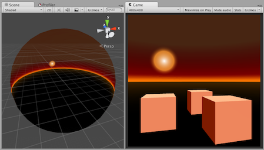
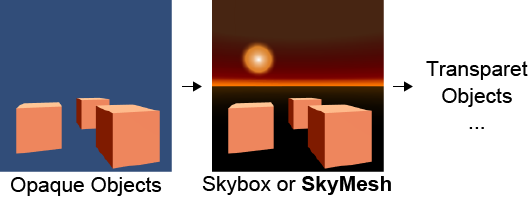

# SkyMesh shader for Unity
Do you want to use your own **sky sphere model** made in 3D modeling software (e.g. Blender, Maya)?
In that case, the SkyMesh shader in this repository will be **useful and efficient**.

## How to use?
### 0. Think twice if you really need to render sky with your mesh.
In many cases, you should use [Skybox](http://docs.unity3d.com/Manual/class-Skybox.html) instead,
because **SkyMesh is not suitable for GI**.
Unity can import several types of textures as [Cubemaps](http://docs.unity3d.com/Manual/class-Cubemap.html).
Even if you don't want to use Cubemaps, **you'd better write your custom Skybox shader** if the mapping between view direction and color (or texture coordinates) is simple enough.

### 1. Import your sky model, and create SkyMesh material.
You can also use builtin meshes.
Create a material and select "Custom/SkyMesh" as the shader.

### 2. Choose radius of the sky. Finite or infinite?
Unity's skybox is rendered as **a sphere of infinite radius** when camera mode is perspective.
This means sky appearance doesn't depend on translation of camera,
but depends only on rotation and field of view of it.
If you prefer this behaviour, **uncheck Finite Radius checkbox** of your material.

If your camera mode is orthographic or you prefer camera-translation-dependent sky,
**check Finite Radius checkbox**.

In both cases, the sky mesh **doesn't need to be within the view volume** (read below).

### 3. Choose a renderer. MeshRenderer or CommandBuffer?
#### CommandBuffer
Attatch SkyMesh script to your main camera, and fill all the properties.
"Camera Event" is recommended to be "After Image Effects Opaque" for efficiency.
#### MeshRenderer
Create GameObject, and attach MeshFilter with your mesh and MeshRenderer with the SkyMesh material.
In order to avoid frustum culling, you have to scale the object or
[Mesh.bounds](http://docs.unity3d.com/ScriptReference/Mesh-bounds.html).

## Features
### The sky is rendered even if far away from the camera.
Sky meshes will be rendered even if the actual meshes are outside camera view volumes.
The mesh is rendered as if it is stuck on the far plane of the volume.
It doesn't cosume your depth buffer bits.

### Efficient rendering order.
The rendering order is as efficient as builtin Skybox.
The areas hidden by opaque objects are culled by depth test.

